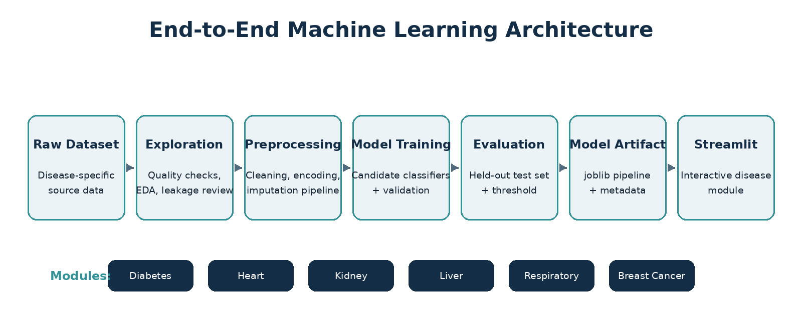
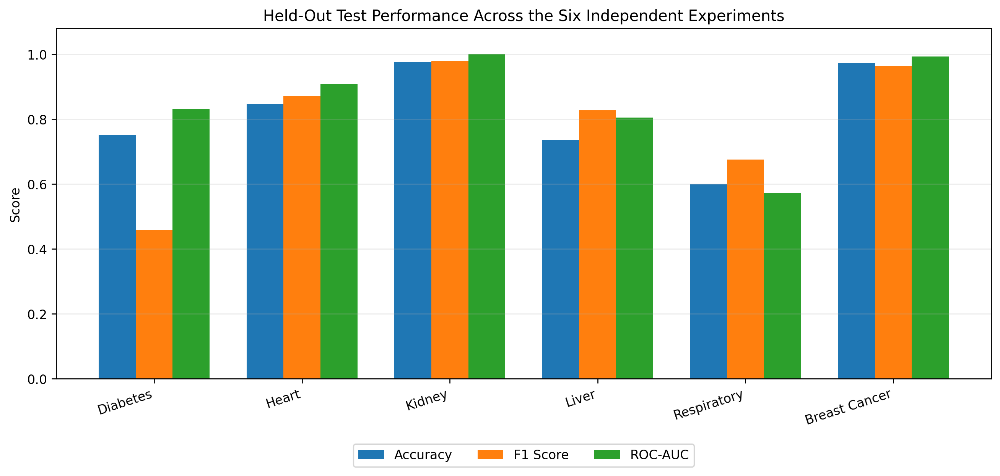
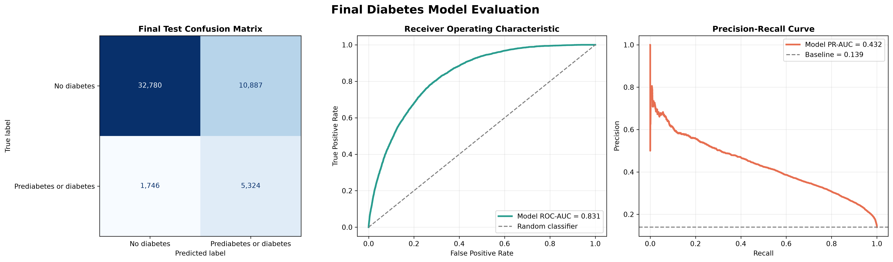
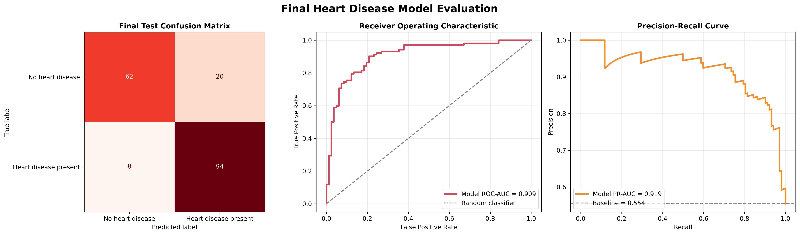
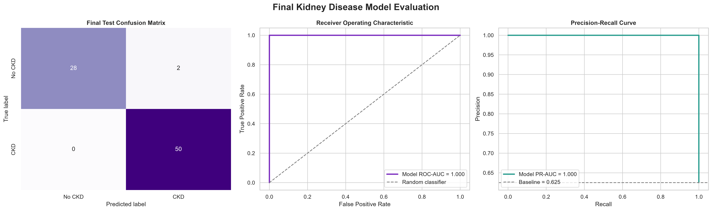
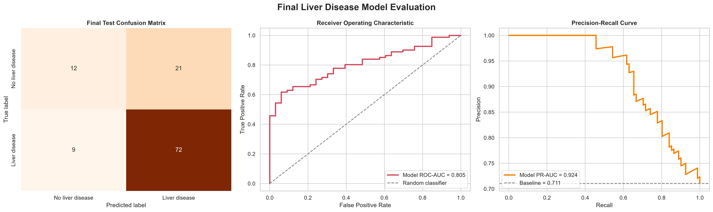
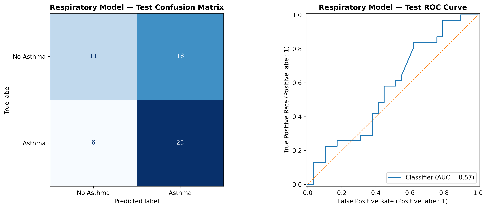
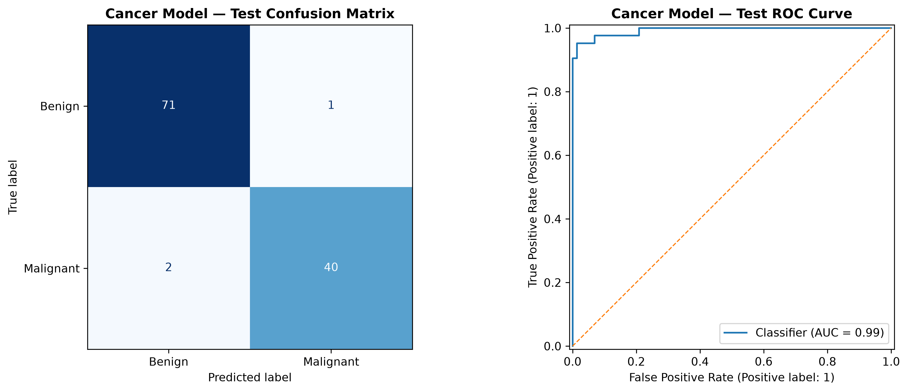

# Multi-Disease Machine Learning System

<p align="center">
  <b>Artificial Intelligence Course Project</b><br>
  Six independent machine-learning classifiers integrated into one Streamlit application.
</p>

---

## Project Overview

The **Multi-Disease Machine Learning System** is an academic AI project that integrates six supervised classification models for:

- Diabetes
- Heart Disease
- Chronic Kidney Disease
- Liver Disease
- Respiratory Disease / Asthma
- Breast Cancer

Each disease module includes its own dataset exploration, preprocessing, model training, evaluation, saved model artifact, and Streamlit prediction interface.

## System Architecture

<p align="center">
  
</p>

The project follows a complete machine-learning workflow:

**Dataset → Exploration → Preprocessing → Training → Validation → Threshold Selection → Test Evaluation → Model Export → Streamlit Deployment**

## Final Model Performance

<p align="center">
  
</p>

| Disease | Selected Model | Accuracy | Recall | F1 Score | ROC-AUC |
|---|---|---:|---:|---:|---:|
| Diabetes | HistGradientBoostingClassifier | 75.10% | 75.30% | 45.74% | 83.13% |
| Heart Disease | Logistic Regression | 84.78% | 92.16% | 87.04% | 90.85% |
| Chronic Kidney Disease | Logistic Regression | 97.50% | 100.00% | 98.04% | 100.00% |
| Liver Disease | Logistic Regression | 73.68% | 88.89% | 82.76% | 80.47% |
| Respiratory Disease | Support Vector Machine | 60.00% | 80.65% | 67.57% | 57.17% |
| Breast Cancer | Logistic Regression | 97.37% | 95.24% | 96.39% | 99.27% |

> **Important:** These are six independent experiments based on different datasets. Their scores should not be interpreted as a direct comparison of clinical disease-diagnosis difficulty.

---

# Model Evaluation Results

## Diabetes

<p align="center">
  
</p>

## Heart Disease

<p align="center">
  
</p>

## Chronic Kidney Disease

<p align="center">
  
</p>

## Liver Disease

<p align="center">
  
</p>

## Respiratory Disease / Asthma

<p align="center">
  
</p>

The respiratory model deliberately excludes the **Medication** field because it creates target leakage. The lower reported performance is therefore methodologically more defensible than an artificially inflated result.

## Breast Cancer

<p align="center">
  
</p>

---

## Project Structure

```text
Multi_Disease_ML_System/
│
├── app/
│   ├── main.py
│   └── pages/
│       ├── 1_Diabetes.py
│       ├── 2_Heart_Disease.py
│       ├── 3_Kidney_Disease.py
│       ├── 4_Liver_Disease.py
│       ├── 5_Respiratory_Disease.py
│       └── 6_Cancer_Disease.py
│
├── assets/
│   └── readme/
│       ├── system_architecture.png
│       ├── final_performance_comparison.png
│       └── ...
│
├── data/
├── models/
├── notebooks/
├── reports/
├── src/
├── README.md
├── requirements.txt
└── Run_Project.bat
```

## Technologies

- Python
- pandas
- NumPy
- scikit-learn
- SciPy
- Matplotlib
- Seaborn
- joblib
- Streamlit
- Jupyter Notebook

## Running the Project

### Windows

Double-click:

```text
Run_Project.bat
```

Or run manually:

```bash
".venv\Scripts\python.exe" -m streamlit run app\main.py
```

Then open:

```text
http://localhost:8501
```

## Installation

```bash
python -m venv .venv
".venv\Scripts\python.exe" -m pip install -r requirements.txt
```

## Academic Scope

This application is an **educational machine-learning project**. Its outputs are model classifications or screening indicators and must not be interpreted as medical diagnoses or clinical probabilities.

## Key Methodological Points

- Separate disease-specific ML pipelines
- Exploratory Data Analysis for each dataset
- Prevention of target leakage
- Training / validation / held-out test workflow
- Validation-based model and threshold selection
- Evaluation using multiple classification metrics
- Saved reproducible `joblib` artifacts
- Streamlit deployment
- End-to-end quality testing

## Conclusion

The project demonstrates a complete machine-learning lifecycle across six structured healthcare classification tasks. The strongest held-out results were obtained by the Chronic Kidney Disease and Breast Cancer models, while the Respiratory Disease module demonstrates the importance of maintaining data integrity even when leakage prevention reduces apparent performance.

---

<p align="center">
  <b>Multi-Disease Machine Learning System</b><br>
  Artificial Intelligence Course Project
</p>
